# Chinook Data Warehouse & Analytics Project

## Project Overview

This project demonstrates a complete end-to-end analytics workflow using PostgreSQL, Python, and Data Warehouse principles.

The project is based on the Chinook music store dataset and includes:

* Data extraction and transformation using Python
* API integration for historical currency exchange rates
* Data Warehouse (DWH) implementation in PostgreSQL
* Star Schema dimensional modeling
* Business analytics using SQL
* Data analysis and visualization using Python
* Customer segmentation and recommendation system

The goal of this project was to build a reusable analytical environment that supports reporting, trend analysis, customer analytics, and business decision-making.

---

# Technologies Used

## Database

* PostgreSQL
* Supabase

## SQL

* CTEs
* Window Functions
* Views
* Aggregations
* Ranking Functions
* Indexing

## Python

* Pandas
* NumPy
* SQLAlchemy
* Requests
* Matplotlib
* Seaborn
* Jupyter Notebook

## Data Engineering

* ETL Pipelines
* API Integration
* Data Warehouse Design
* Star Schema Modeling

---

# Architecture

## Staging Layer (stg)

Raw operational data was loaded into the staging schema.

Additional datasets were integrated through Python ETL processes:

* Department budget data
* Historical currency exchange rates (USD → ILS)

---

# Data Warehouse Architecture

The project follows a Star Schema design.

## Dimension Tables

### dim_customer

Customer information and customer attributes.

Additional transformations include:

* Standardized customer names
* Email domain extraction for future analysis

### dim_track

Track information enriched with:

* Album
* Artist
* Genre
* Media Type

Additional transformations include:

* Track duration converted from milliseconds to seconds
* Human-readable track duration format (MM:SS)

### dim_employee

Employee hierarchy and department information.

Additional attributes include:

* Department name
* Department budget
* Employee tenure
* Email domain
* Manager flag (`is_manager`)

### dim_playlist

Bridge table between playlists and tracks.

Includes playlist metadata and track relationships for playlist-level analysis.

### dim_currency

Currency exchange rates used for USD → ILS conversion.

This dimension enables revenue reporting in both USD and local currency (ILS).

---

## Fact Tables

### fact_invoice

Invoice-level sales data.

Additional calculated fields include:

* Revenue in USD
* Revenue in ILS using historical exchange rates

### fact_invoice_line

Track-level sales transactions.

Additional calculated fields include:

* Line total amount
* Revenue in ILS

---

## Analytical View

### rankings_sales_country_v

Reusable analytical view created for country sales ranking and genre distribution analysis.

The view contains:

* Top 5 countries by revenue
* Bottom 5 countries by revenue
* Ranking information for further business analysis

---

# Entity Relationship Diagram

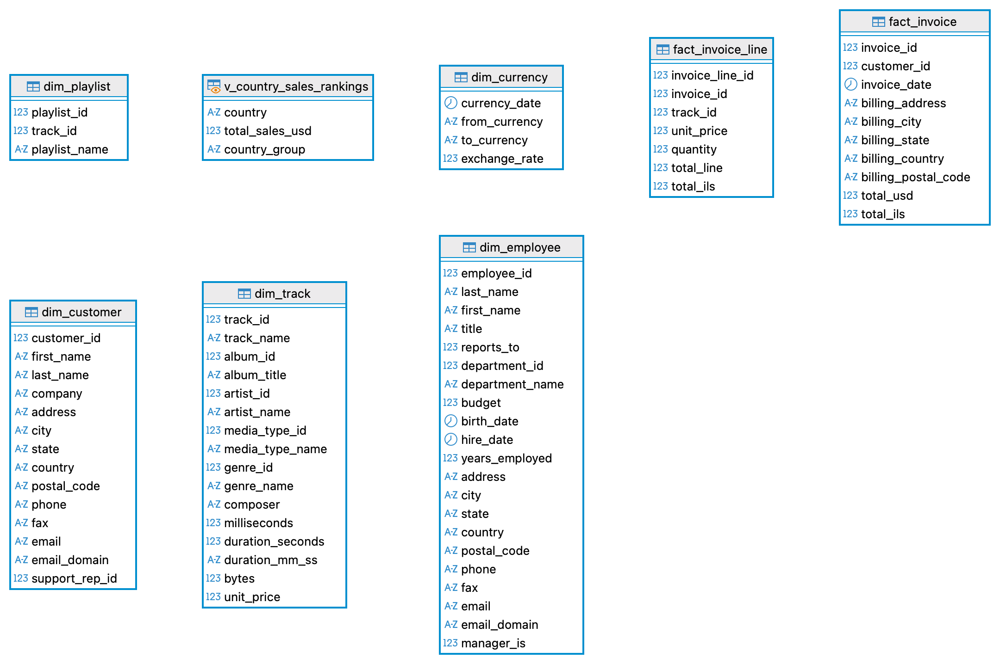

---

# ETL Process

## Department Budget Integration

Department budget information was collected from multiple source files.

The ETL process included:

* Reading JSON and delimited files using Pandas
* Merging department information
* Aggregating department budgets
* Loading the final dataset into PostgreSQL staging tables

## Currency Exchange Rate API

Historical USD to ILS exchange rates were retrieved using an external API.

The process included:

* Extracting invoice dates from PostgreSQL
* Calling the API for each invoice date
* Creating a currency rates dataset
* Loading the results into PostgreSQL

The currency dimension was later used to calculate revenue in local currency (ILS).

---

# SQL Analytics

## Analysis 1 – Playlist Size Analysis

**Business Question**

Which playlists contain the largest and smallest number of tracks?

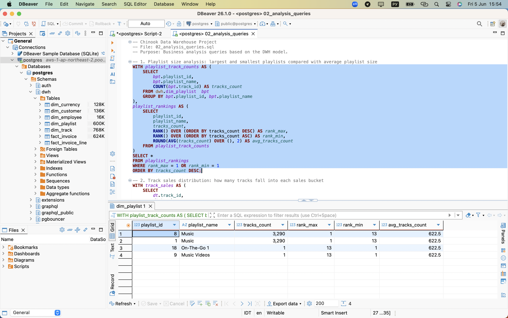

### Key Findings

* Playlist **Music** contains 3,290 tracks.
* Playlists **On-The-Go 1** and **Music Videos** contain only one track.
* Average playlist size is 622.5 tracks.

---

## Analysis 2 – Track Sales Distribution

**Business Question**

How are tracks distributed by sales frequency?

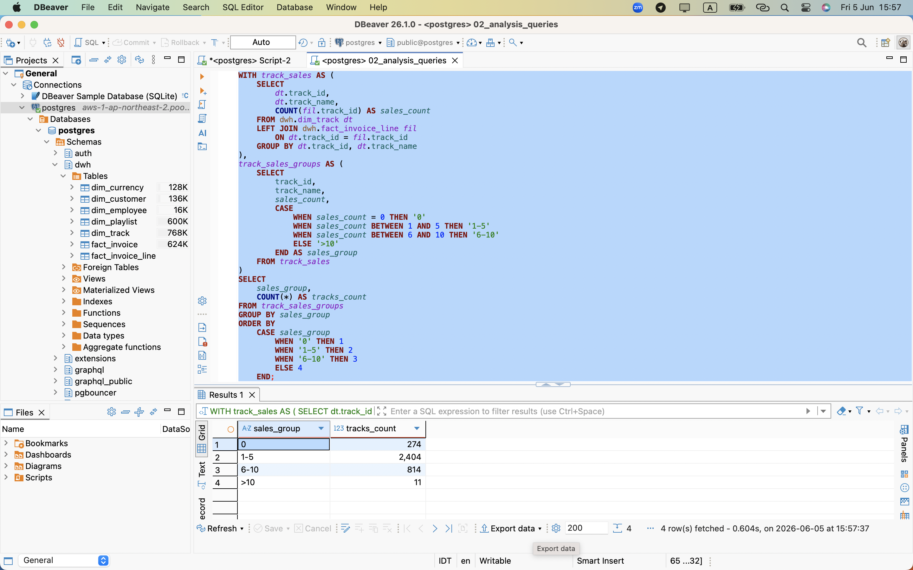

### Key Findings

* 274 tracks were never sold.
* 2,404 tracks were sold between 1–5 times.
* 814 tracks were sold between 6–10 times.
* Only 11 tracks were sold more than 10 times.

---

## Analysis 3 – Country Revenue Ranking

**Business Question**

Which countries generate the highest and lowest revenue?

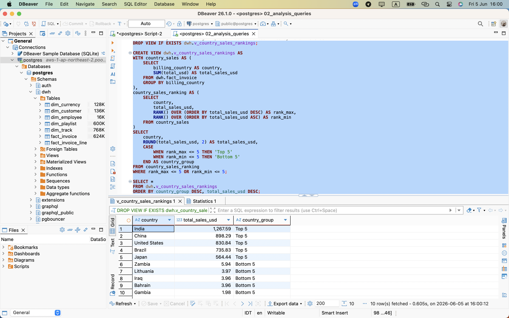

### Key Findings

* India, China, and the United States generated the highest revenue.
* Gambia, Iraq, and Bahrain generated the lowest revenue.

---

## Analysis 4 – Genre Mix Analysis

**Business Question**

What are the most popular genres in top-performing and bottom-performing countries?

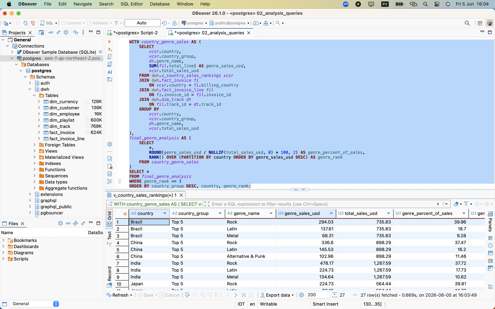

### Key Findings

* Rock was the dominant genre in most top-performing countries.
* Rock accounted for approximately 37–40% of total sales in several top markets.
* High-revenue countries demonstrated broader genre diversity.

---

## Analysis 5 – Customer Purchase Behavior

**Business Question**

How does customer purchasing behavior differ between countries?

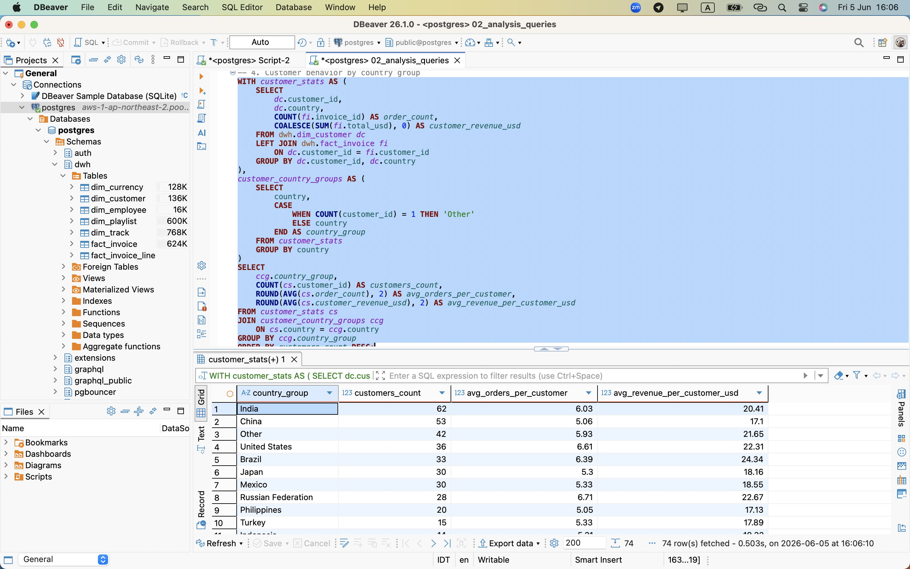

### Key Findings

* India had the largest customer base.
* The United States and Brazil showed relatively high revenue per customer.
* Customer value varies significantly across countries.

---

## Analysis 6 – Employee Sales Performance

**Business Question**

How does employee sales performance evolve over time?

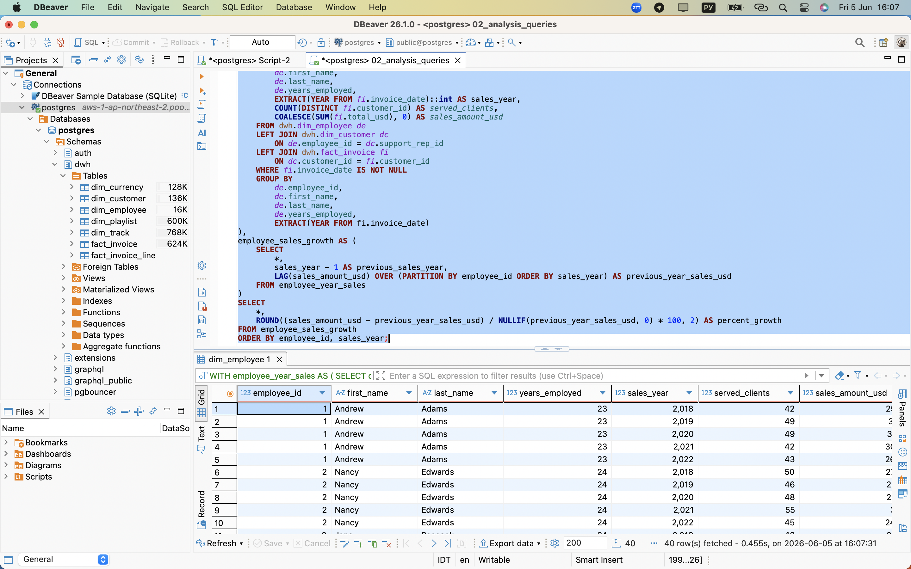

### Key Findings

* Employee performance varies across years.
* Some employees demonstrated strong growth while others experienced declines.
* Customer count and sales revenue appear positively related.

---

## Analysis 7 – Genre Revenue Growth

**Business Question**

Which music genres demonstrate the strongest revenue growth over time?

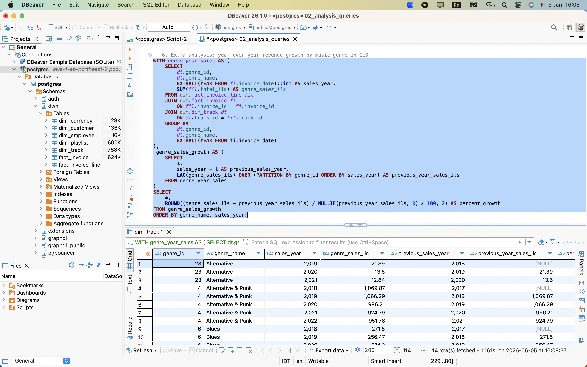

### Key Findings

* Revenue growth differs significantly across genres.
* The analysis helps identify growing and declining music categories.

---

# Python Analytics

## Analysis 1 – Artist & Genre Popularity

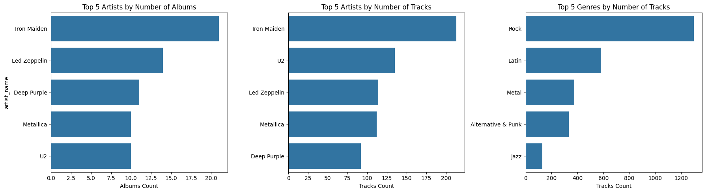

### Key Findings

* Iron Maiden leads the catalog by both album count and track count.
* Rock is the dominant genre with the highest number of tracks.
* A relatively small number of artists account for a large share of the catalog.

---

## Analysis 2 – Customer Revenue Analysis

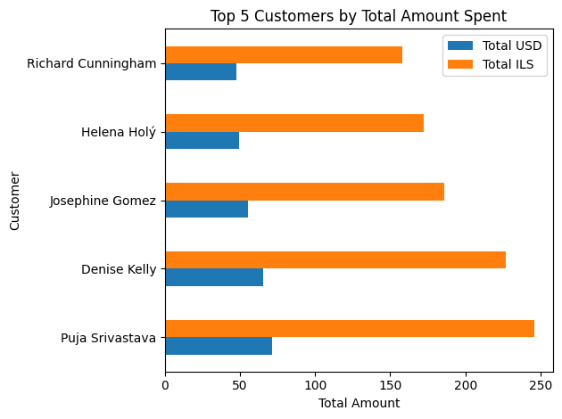

### Key Findings

* A small group of customers generates a disproportionate share of total revenue.
* Top customers show significantly higher spending than the average customer.

---

## Analysis 3 – Monthly Revenue Trends

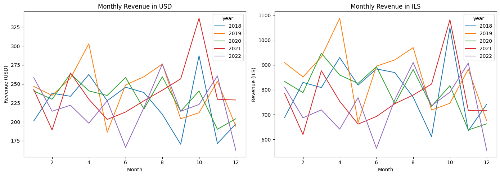

### Key Findings

* Revenue fluctuates across months and years.
* Several months consistently outperform others, indicating seasonality patterns.

---

## Analysis 4 – Track Duration vs Sales Correlation

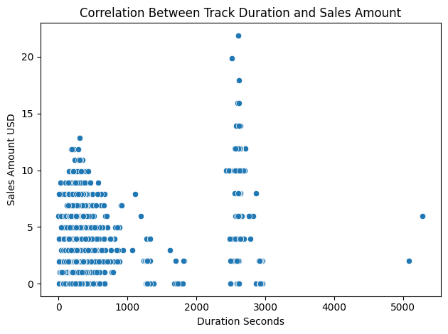

### Key Findings

* Correlation coefficient ≈ 0.15.
* Track duration has only a weak relationship with sales performance.

---

## Analysis 5 – Music Recommendation Engine

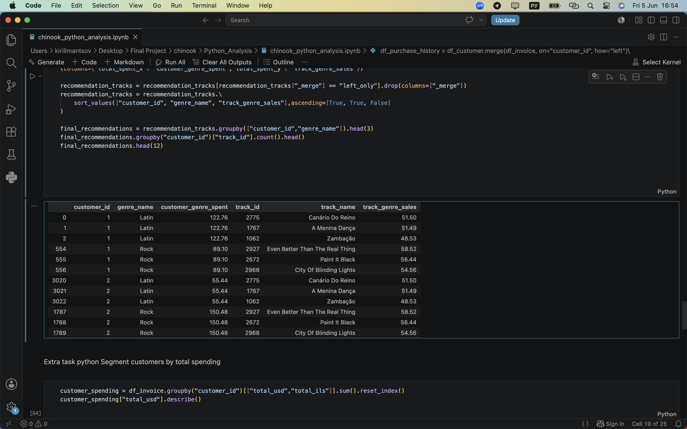

### Description

A recommendation engine was built using customer purchase history and genre preferences.

The process:

* Identified customer favorite genres
* Calculated genre-level spending
* Selected top-selling tracks within each genre
* Excluded tracks already purchased by the customer
* Generated personalized recommendations

### Skills Demonstrated

* Data preparation
* Data merging
* Ranking logic
* Recommendation systems

---

## Analysis 6 – Customer Segmentation

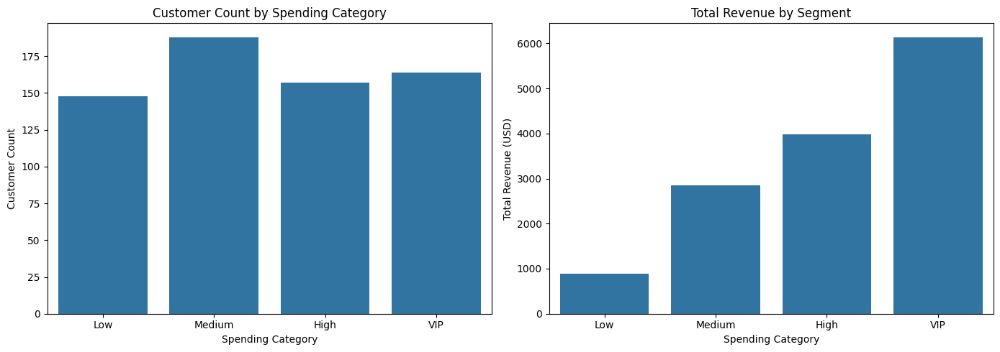

### Key Findings

Customers were segmented into:

* Low
* Medium
* High
* VIP

The analysis compared:

* Customer count
* Total revenue
* Average revenue per customer

VIP customers generated the highest total revenue despite representing a smaller share of the customer base.

---

# Business Insights

### Revenue Concentration

A relatively small group of countries and customers generates a significant share of total revenue.

### Genre Dominance

Rock is the dominant genre across most high-performing markets.

### Customer Value

Customer purchasing behavior differs significantly across countries and customer segments.

### Employee Performance

Sales performance varies across employees and years, making trend analysis valuable for performance monitoring.

### Customer Segmentation

VIP customers represent the most valuable customer group and contribute disproportionately to overall revenue.

### Recommendation Opportunities

Purchase history can be successfully leveraged to generate personalized music recommendations.

---

# Key Skills Demonstrated

## SQL

* Data Warehouse Design
* Star Schema Modeling
* CTEs
* Window Functions
* Views
* Indexing
* Revenue Analysis
* Customer Analytics

## Python

* Data Cleaning
* Data Transformation
* Data Visualization
* Customer Segmentation
* Correlation Analysis
* Recommendation Systems
* API Integration

## Business Analytics

* Revenue Analysis
* Customer Behavior Analysis
* Employee Performance Tracking
* Trend Analysis
* Market Segmentation
* Business Intelligence

---

# Author

**Kyrylo Mantsov**

Aspiring Data Analyst focused on SQL, Python, Data Warehousing, and Business Intelligence.

LinkedIn:
https://www.linkedin.com/in/kyrylo-mantsov-259ba4168
